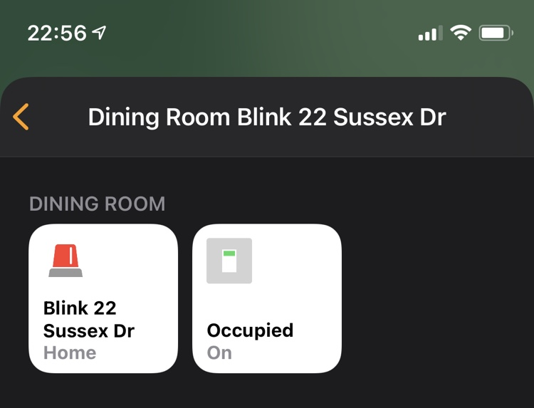
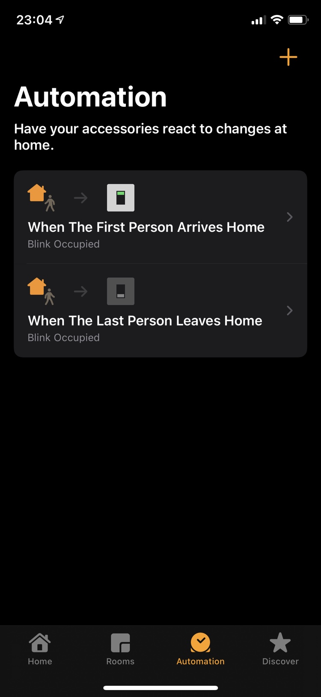

# homebridge-blink-for-home


## Overview

This enables Blink Cameras to the HomeBridge platform. This includes:
* Security System Arm / Disarming
* Occupied Switch
* Camera Thumbnails (Liveview WIP)
* Temperature Sensors
* Alerts

## Setup

To configure this set it up as a platform in your homebridge config.json file.


```
"platforms" : [
  {
    "name"     : "Blink",
    "username" : "<your blink email address>",
    "password" : "<your blink password>",
    "pin"      : "<pin>",
    "platform" : "Blink"
  }
]
```

### Configuration Parameters

* _name_: Only necessary if you want to support multiple Blink accounts. This is used to generate a unique client-id
* _username_: Your blink username
* _password_: Your blink password
* _pin_: After 2FA email, this is the PIN provided

### 2FA support
If you have 2FA enabled, you will need to first set the username / password to force the system to attempt to login. On first attempt it will trigger the email validation. With the PIN provided from the 2FA email, update the pin field to proceed. The pin is only needed once per account.

_NB: The Device in the email 2FA will appear to be an iPad Mini. This is intentional to increase masquerading._

## Accessories
Two main accessory types will be present: `Security System` and `Camera` accessories. 

### Security System Accessories


* one `Security System` accessory per location (aka Network)
* includes a `Occupied` switch to indicate if the home occupied which is used to distinguish between `Home`, `Away` and `Off`
* Blink will be disarmed when the system is set to `Home` (when occupied = on) or `Off`




* Use an automation to automatically arm the system and set to `Away`. This is a useful way to avoid the alerts sent from HomeKit when the Security System is set to `Off`. (All members will get an alert each time Homekit is restarted)



### Camera Accessories


* each `Camera` supports a number of sub accessories including temperature, motion sensor, motion tracking (when armed), and a privacy switch


* `privacy mode` prevents the perception that when the system is disarmed that people can be snooping. This is particularly important since even a stale thumbnail can give household members that feeling that the camera is active when its not.
* cameras can be disabled individually when the system is armed with the `Motion Activated` switch 
